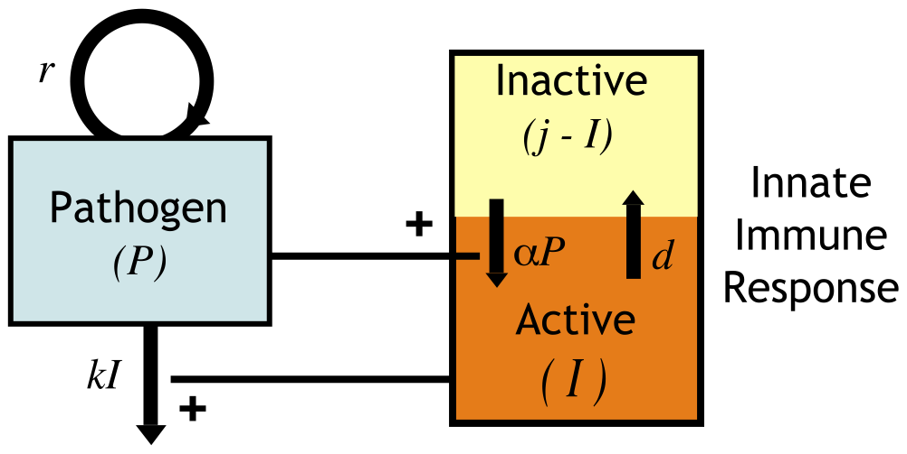
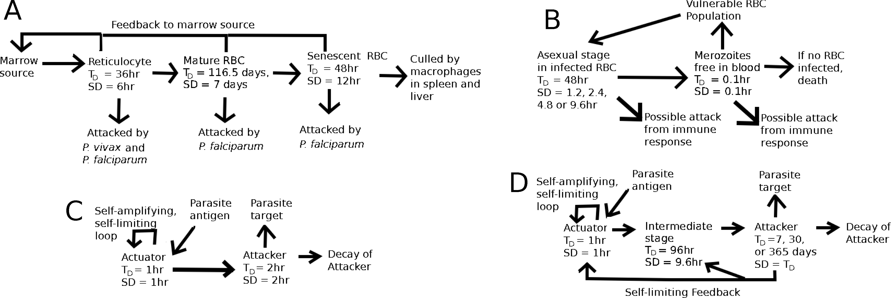
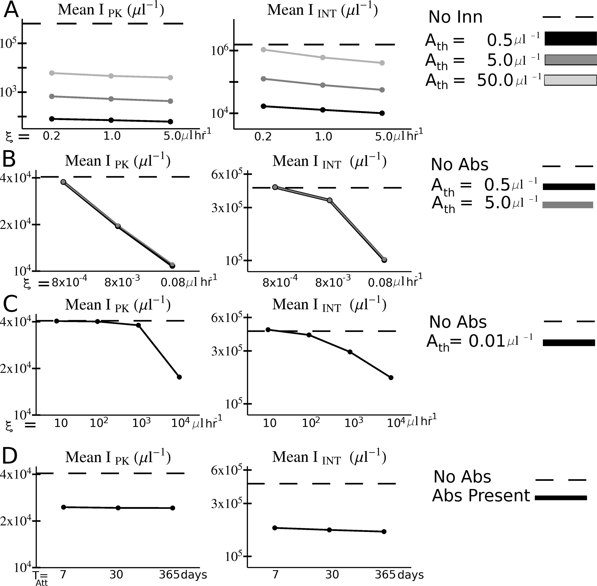

## Introduction

- Macroparasites are "big things" (> bacteria)
- Mostly extracellular  
- Important for human health:
  - Malaria
  - Worms/Helminths

## Malaria Infection models

- Models have been widely used to study malaria infections
- The models range from relatively simple to very complex
- We'll briefly look at a few examples
- There is nothing fundamentally different between these and the models we have seen so far.

## Malaria Example 1

"On the Control of Acute Rodent Malaria Infections by Innate Immunity" by Kochin et al (2010) PLoS One

Question: Does resource limitation (running out of red blood cells) or innate immunity control the initial stage of malaria infections?

Approach: Simple mathematical model fit to data from rodent malaria co-infections with two malaria strains (AJ and AS). Quality of fit is used to discriminate between model variants/hypotheses.

## Malaria Example 1

$$
\begin{aligned}
\dot{P} & = r P - k P I \qquad & \textrm{Pathogen}\\
\dot{I} & = \alpha P (j-I) - d I \qquad  & \textrm{Innate IR}
\end{aligned}
$$

{fig-align="center"}

## Malaria Example 1

$$
\begin{aligned}
\dot{P_{AJ}} & = r_{AJ} P_{AJ} - k_{AJ}P_{AJ} I \qquad & \textrm{AJ strain}\\
\dot{P_{AS}} & = r_{AS} P_{AS} - k_{AS}P_{AS} I \qquad & \textrm{AS strain}\\
\dot{I} & = (\alpha_{AS} P_{AS} + \alpha_{AJ} P_{AJ}) (j-I) - d I \qquad & \textrm{Innate IR}
\end{aligned}
$$

* Simple model
* Ignores intracellular processes
* Only a single equation for innate immune response

## Malaria Example 1

{fig-align="center"}

## Malaria Example 2

"Host Control of Malaria Infections: Constraints on Immune and Erythropoeitic Response Kinetics" by McQueen & McKenzie (2008) PLoS Comp Bio

Question: Which components of the immune response help to control malaria infections?

Approach: Complex mathematical model explored for different parmaeter values.

## Malaria Example 2

{fig-align="center"}

## Malaria Example 2

{fig-align="center"}

## Worm Infection models

- There are relatively fewer within-host models for worms
- Again, the models range from relatively simple to very complex
- We'll briefly look at a few examples
- There is nothing fundamentally different between these and the models we have seen so far.

## Worm Infection Example 1

“Modelling within‑host parasite dynamics of schistosomiasis” by Chiyaka et al 2010 CMMM

Question: How can within-host parasite dynamics be controlled by different parts of the immune response?

Approach: Medium-size mathematical model explored for different parmaeter values.

## Worm Infection Example 1

$$
\begin{align}
\dot{L}   &= \lambda\,f(L,E) - \bigl(m_L + \mu_L + d_L\bigr)\,L, 
            && \text{(larval stage \(L\))}\\[4pt]
\dot{W}_I &= m_L\,L - \bigl(m_I + \mu_I + d_I\bigr)\,W_I, 
            && \text{(immature worms \(W_I\))}\\[4pt]
\dot{W}_P &= \tfrac{1}{2}m_I\,W_I - \bigl(m_P + \mu_P\bigr)\,W_P, 
            && \text{(paired adult worms \(W_P\))}\\[4pt]
\dot{E}   &= m_P\,N_E\,W_P - \bigl(m_E + \mu_E\bigr)\,E, 
            && \text{(eggs \(E\))}\\[8pt]
\dot{M}_R &= s_R + r_R\bigl(L + W_T + E\bigr)M_R             && \text{(resting macrophages \(M_R\))}\\[4pt]
          &  - s_A\bigl(L + W_T + E\bigr)M_R 
            + \beta_A\,M_A - \mu_R\,M_R, \\
\dot{M}_A &= s_A\bigl(L + W_T + E\bigr)M_R 
            - \beta_A\,M_A - \mu_A\,M_A, 
            && \text{(activated macrophages \(M_A\))}\\[4pt]
\dot{T}   &= s_T + r_T\bigl(E + M_R + M_A\bigr)T - \mu_T\,T.
            && \text{(T cells \(T\))}
\end{align}
$$

More equations for model variants discussed in the paper.

## Worm Infection Example 1

!Time series ](./media/chiyaka2009fig3.png){fig-align="center"}

## Worm Infection Example 2

